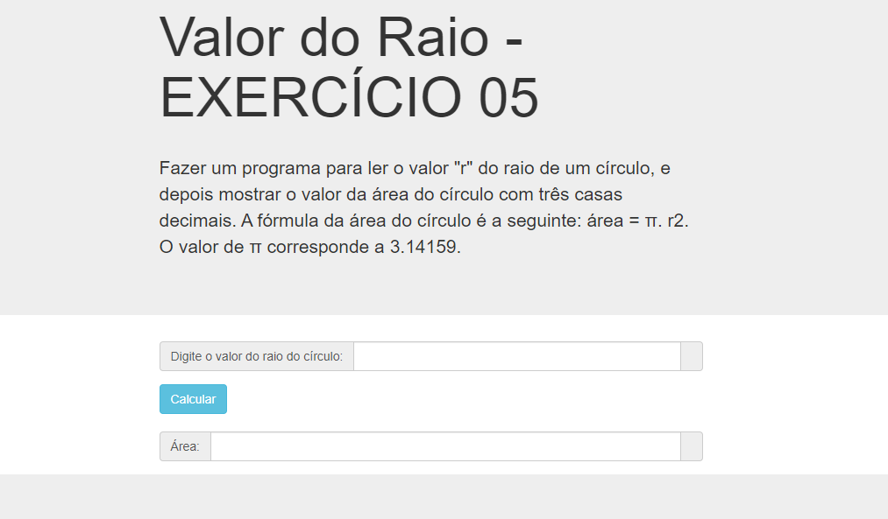

# Jovens Tegranos Exercicio 05

# 🏁 Tópicos

 * 👉 Banner
 * 👉 Título e Descrição
 * 👉 Status do Projeto
 * 👉 Funcionalidades
 * 👉 Demonstração da aplicação
 * 👉 Pré-requisitos
 * 👉 Tecnologias utilizadas
 * 👉 Autor
 * 👉 Licença
 
 ____________________________________________________________
# ✅ Banner 👌

<h1 align="center">
  
</h1>

# ✅ Título e Descrição 👌

### Título: Exercicio 05

 Descrição: Fazer um programa para ler o valor "r" do raio de um círculo, e depois mostrar o valor da área do círculo com três casas decimais. A fórmula da área do círculo é a seguinte: área = π. r2. O valor de π corresponde a 3.14159. 

# ✅ Status do Projeto 👌

🚧 Projeto 🚀 Concluído com Sucesso!!! 👌 🚧

# ✅ Funcionalidades 👌

Funcionalidades da aplicação:

- [x] Ler o valor "r" do raio de um círculo,
- [x] Mostrar o valor da área do círculo com três casas decimais

# ✅ Demonstração da aplicação 👌

### GitHub
### AlineAlmeida85

### Link: 

<h1 align="center">
  
</h1>

# ✅ Pré-requisitos 👌

Nenhum, basta clicar no link acima

# ✅ Tecnologias utilizadas ⚒️ 👌

As seguintes tecnologias foram usadas na construção do projeto:

- [HTML](https://pt.wikipedia.org/wiki/HTML)
- [CSS](https://pt.wikipedia.org/wiki/Cascading_Style_Sheets)
- [JavaScript](https://www.javascript.com/)

# ✅ Autor 👌

Aline Almeida 💝

# ✅ Licença

Não Possui

Espero que te agrade! ❤️